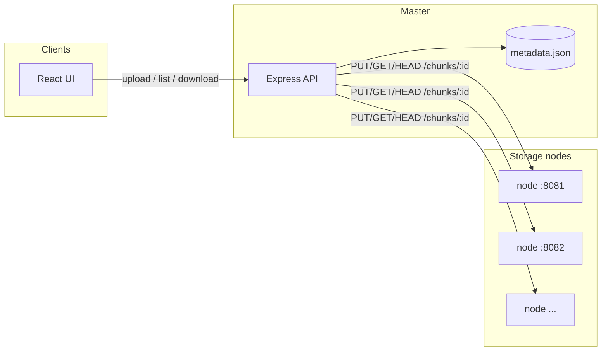

# Distributed file storage

A small educational distributed file store: uploads are split into **1 MB chunks**, each chunk is stored under a **SHA-256 id** on multiple **storage nodes**, and a **master** service keeps catalog metadata, tracks node health, and streams downloads by reading chunks from healthy replicas.

The **web UI** lists files and nodes, runs periodic storage verification (HEAD probes against each replica), and surfaces degraded or unreadable state when chunks are missing on disk.



## Requirements

- **Node.js** 18 or newer (global `fetch` on the master and nodes).

## Repository layout

| Path | Role |
|------|------|
| `backend/` | Master API (`server.js`), storage node (`storage-node.js`), metadata store, scripts |
| `frontend/` | React + Vite UI |
| `data/` | Default chunk directories when using `scripts/start-nodes.sh` (`data/node1` …) |

## Quick start (local development)

Use **three terminals** from the repository root.

### 1. Storage nodes

Starts five nodes on **8081–8085** with data under `data/node1` … `data/node5`:

```bash
cd backend && npm install && npm run start:nodes
```

Leave this running. Stop with **Ctrl+C** (the script cleans up child processes).

### 2. Master

```bash
cd backend && npm run dev
```

Listens on **http://localhost:8000** by default and assumes storage nodes at `http://localhost:8081` … `http://localhost:8085` (see configuration below).

### 3. Web UI

```bash
cd frontend && npm install && npm run dev
```

Open the URL Vite prints (usually **http://localhost:5173**). The dev server **proxies** `/upload`, `/download`, `/files`, and `/nodes` to the master (`http://localhost:8000` unless you override `VITE_MASTER_URL`).

Upload a file from the UI; the dashboard refreshes every few seconds and shows replica placement and health.

### Production-like preview

Build the UI and serve it with Vite preview (proxy matches dev):

```bash
cd frontend && npm run build && npm run preview
```

Keep the master and storage nodes running as above.

## Configuration

### Master and nodes (`backend`)

| Variable | Default | Description |
|----------|---------|-------------|
| `PORT` | `8000` | Master HTTP port |
| `REPLICATION_FACTOR` | `3` | Target replicas per chunk (requires enough healthy nodes) |
| `STORAGE_NODE_COUNT` | `5` | How many node URLs the master uses |
| `STORAGE_BASE_PORT` | `8081` | First port when `STORAGE_NODES` is not set (`8081`, `8082`, …) |
| `STORAGE_NODES` | *(derived)* | Comma-separated URLs, e.g. `http://localhost:8081,http://localhost:8082` |
| `METADATA_PATH` | `backend/metadata.json` | File-backed catalog |
| `MAX_UPLOAD_BYTES` | `1073741824` | Max upload size (bytes) |

Each **storage node**:

| Variable | Default | Description |
|----------|---------|-------------|
| `PORT` | `8081` | Node listen port |
| `DATA_DIR` | `./data/node-<PORT>` under cwd | Directory for chunk files |
| `NODE_ID` | `node-<PORT>` | Label in logs |

### Frontend (`frontend`)

| Variable | Default | Description |
|----------|---------|-------------|
| `VITE_MASTER_URL` | `http://localhost:8000` | Proxy target for API routes during `vite dev` / `vite preview` |

Create `frontend/.env.local` if the master runs elsewhere.

## HTTP API (overview)

| Method / path | Purpose |
|---------------|---------|
| `POST /upload` | Multipart upload (`file` field); chunks replicated and catalog updated |
| `GET /download/:fileId` | Stream reconstructed file |
| `GET /files`, `GET /files/:fileId` | Catalog; add `?verify=1` for replica probes and enriched chunk info |
| `DELETE /files/:fileId` | Remove catalog entry and delete chunks on nodes |
| `GET /nodes/status` | Per-node health and cluster summary |

Storage nodes expose `GET /health`, `PUT/GET/HEAD/DELETE /chunks/:chunkId`.

## Scripts

| Command | Where | Description |
|---------|-------|-------------|
| `npm run dev` | `backend/` | Start master |
| `npm run start:nodes` | `backend/` | Five nodes via `scripts/start-nodes.sh` |
| `npm run start:nodes:terminals` | `backend/` | Alternative launcher (separate terminals) |
| `npm run dev` | `frontend/` | Vite dev server |
| `npm run build` | `frontend/` | Production bundle |
| `npm run preview` | `frontend/` | Preview build with API proxy |
| `npm run lint` / `npm run test` | `frontend/` | ESLint and Vitest |

## Development notes

- **Uploads** need at least **`REPLICATION_FACTOR` healthy** storage nodes.
- If every replica of a chunk is missing, the catalog entry can be **removed** after a verified listing (`GET /files?verify=1`).
- Chunk files on disk are named by **64-character hex** SHA-256 ids; deleting files under `data/node*` is a simple way to simulate loss and watch the UI report degraded or unreadable state.

## License

This project is provided as-is for learning and experimentation.
